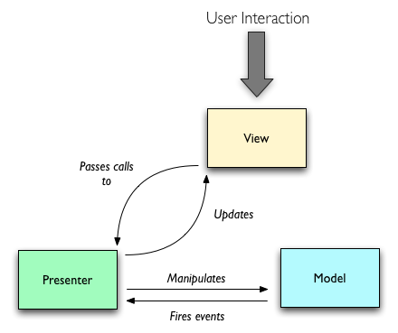

[](https://gitter.im/FrantisekGazo/Blade?utm_source=badge&utm_medium=badge&utm_campaign=pr-badge)

[](https://travis-ci.org/FrantisekGazo/Blade)
[](https://android-arsenal.com/details/1/3280)


----------------------------
Android library for boilerplate destruction - *"Just code what is worth coding"*

* Generates boilerplate code based on used annotations and lets you focus on what matters.
* Generated code is fully traceable.
* Everything is generated during compile time.
* No reflection used!
* Consists of modules.

# Usage
This library is divided into several **modules**. Each module provides different annotation and support classes:
* **arg** provides [@Arg](https://github.com/FrantisekGazo/Blade#arg)
* **extra** provides [@Extra](https://github.com/FrantisekGazo/Blade#extra)
* **state** provides [@State](https://github.com/FrantisekGazo/Blade#state)
* **mvp** provides [@Presenter](https://github.com/FrantisekGazo/Blade#presenter)

Special annotation:
* [@Blade](https://github.com/FrantisekGazo/Blade#blade)


## @Arg
Annotation for generating `newInstance()` methods for your [Fragment](http://developer.android.com/reference/android/app/Fragment.html) classes.

Without using this library you would have to write this:

```Java
public class MyFragment extends Fragment {

    private static final String EXTRA_TEXT = "arg_text";
    private static final String EXTRA_DATA = "arg_data";

    public static MyFragment newInstance(String text, MyData data) {
        MyFragment frag = new MyFragment();
        Bundle args = new Bundle();
        args.putString(EXTRA_TEXT, text);
        args.putParcelable(EXTRA_DATA, data);
        frag.setArguments(args);
        return frag;
    }

    private String mText;
    private MyData mData;

    public void onCreate(Bundle savedInstanceState) {
        super.onCreate(savedInstanceState);
    
        mText = getArguments().getString(EXTRA_TEXT);
        mData = (MyData) getArguments().getParcelable(EXTRA_DATA);
    }
}
```

But with this library you can write this:

```Java
public class MyFragment extends Fragment {

    @Arg 
    String mText;
    @Arg 
    MyData mData;
  
}
```

Class `blade.F` (= Fragment) is automatically generated for you. 
This class contains 1 method for each `Fragment`class with annotated arguments:
* ` X newX(T1 arg1[, T2 arg2, ...]) ` - Creates new instance of class `X`.


e.g. for `MyFragment` class it contains method named `newMyFragment` with 2 parameters: `String` and `MyData`. 
So you can easily create new fragment by calling:
```Java
F.newMyFragment("some-string", new MyData());
```
And given values will be set to corresponding attributes annotated with `@Arg` at the beginning of `onCreate(Bundle)` method.

Class `blade.F` is not `final` so that you can extend it and add more methods.

## @Extra
Annotation for generating `newIntent()` methods for your [Activity](http://developer.android.com/reference/android/app/Activity.html) or [Service](http://developer.android.com/reference/android/app/Service.html) classes.

Without using this library you would have to write this:

```Java
public class MyActivity extends Activity {

    private static final String EXTRA_TEXT = "extra_text";
    private static final String EXTRA_DATA = "arg_data";

    public static Intent newIntent(Contaxt context, String text, MyData data) {
        Intent intent = new Intent(context, MyActivity.class);
        intent.putExtra(EXTRA_TEXT, text);
        intent.putExtra(EXTRA_DATA, data);
        return intent;
    }

    private String mText;
    private MyData mData;

    public void onCreate(Bundle savedInstanceState) {
        super.onCreate(savedInstanceState);
    
        Bundle extras = getIntent().getExtras();
        mText = extras.getString(EXTRA_TEXT);
        mData = (MyData) extras.getParcelable(EXTRA_DATA);
    }
}
```

But with this library you can write this:

```Java
public class MyActivity extends Activity {

    @Extra 
    String mText;
    @Extra
    MyData mData;
  
}
```

Class `blade.I` (= Intent) is automatically generated for you. 
This class contains 2 methods for each `Activity` class with annotated arguments:
* ` Intent forX(Context c, T1 extra1[, T2 extra2, ...]) ` - Creates new `Intent` which can be used for starting new activity. This lets you add additional flags to this intent.
* ` void startX(Context c, T1 extra1[, T2 extra2, ...]) ` - Creates new `Intent` and starts new activity. 

e.g. for `MyActivity` class it contains methods named `forMyActivity` and `startMyActivity` with 2 parameters: `String` and `MyData`. 
So you can easily start new Activity by calling:
```Java
I.startMyActivity(context, "some-string", new MyData());
```
And given values will be set to corresponding attributes annotated with `@Extra` at the beginning of `onCreate(Bundle)` method 
(in `Service`/`IntentService` at the beginning of `onStartCommand(Intent, int, int)`/`onHandleIntent(Intent)`).

Class `blade.I` is not `final` so that you can extend it and add more methods. 

## @State
Annotation for simplifying state management.

For each class containing attributes annotated with `@State` Blade will generate helper class named NameOfClass`_Helper` with 2 static methods for state management:
* `saveState(Bundle)`
* `restoreState(Bundle)`

Classes extending from `Fragment`, `Activity` or `View` are managed automatically, so you don't need to call `saveState(Bundle)` or `restoreState(Bundle)`.
But other classes has to call these 2 generated methods when needed. 

Without using this library you would have to write this:

```Java
public class MyActivity extends Activity {

    private static final String EXTRA_TEXT = "extra_text";
    private static final String EXTRA_DATA = "arg_data";

    private String mText;
    private MyData mData;
    
    @Override
    protected void onSaveInstanceState(Bundle outState) {
        super.onSaveInstanceState(outState);
        outState.putParcelable(EXTRA_DATA, mData);
        outState.putString(EXTRA_TEXT, mText);
    }

    @Override
    protected void onRestoreInstanceState(Bundle savedInstanceState) {
        super.onRestoreInstanceState(savedInstanceState);
        mData = savedInstanceState.getParcelable(EXTRA_DATA);
        mText = (MyData) savedInstanceState.getString(EXTRA_TEXT);
    }   
    
}
```

But with this library you can write this:

```Java
public class MyActivity extends Activity {

    @State 
    String mText;
    @State
    MyData mData;
  
}
```

## @Presenter
Annotation for implementing MVP architecture.



#### How to implement:

1. Create an interface for your view by extending [IView](https://github.com/FrantisekGazo/Blade/blob/master/module/mvp/src/main/java/blade/mvp/IView.java).
    ```Java
    public interface IMyView implements blade.mvp.IView {
        void show(String something);  
    }
    ```

2. Create a Presenter that will interact with the view interface. 
You can either extend [BasePresenter](https://github.com/FrantisekGazo/Blade/blob/master/module/mvp/src/main/java/blade/mvp/BasePresenter.java) 
or implement [IPresenter](https://github.com/FrantisekGazo/Blade/blob/master/module/mvp/src/main/java/blade/mvp/IPresenter.java).
    ```Java
    public class MyPresenter extends blade.mvp.BasePresenter<IMyView, Data> {
    
        public void onUserDidSomething() {
            String s = // do something ...
            
            if (getView() != null) {
                getView().show(s);
            }
        }
        
        //...
    }
    ```

3. Create an implementation for your view interface with presenter field annotated with `@Presenter` (can be more than one). 
`@Presenter` is supported only for android views and activities (not fragments).
    ```Java
    public class MyView extends android.view.View implements IMyView {
        
        @Presenter
        MyPresenter mPresenter;
        
        @Override
        void show(String something) { /* ... */ }
        
        // ...
    }
    ```

4. Call `setTag(data)` method on your view implementation to set the `@Presenter` field.

5. Every Activity class, that can contain View class with presenter, needs to be known to Blade.
If this Activity class does not use presenter, you need to annotate this class with `@Blade`.
    ```Java
    @Blade
    public class MyActivity extends Activity {
        // ...
    }
    ```

#### How does it work?

Each time you call `setTag(data)` method on your view this happens: 

* Unique ID (per activity) is created from **view class**, **presenter class** 
and **data.toString()** combination (so provide custom implementation of `toString()`).
* If presenter for this ID does not exists yet, then it is created via **default constructor** 
and `create(data, boolean)` is called with the **data** given as parameter to `setTag(data)` 
and boolean flag indicating if presenter was recreated from state.
* `@Presenter` field is set with proper instance.
* Presenter is connected to the view by calling `bind(view)`.

If you call `setTag(null)` on view then:
* Presenter is disconnected from the view by calling `unbind()`.
* `@Presenter` field is set to `null`.
* Presenter still lives until containing Activity is finished. (so you can use it again if you set appropriate tag)

(Same applies for any number of `@Presenter` fields inside your view)

#### Presenter lifecycle

Presenter is independent of activity's lifecycle. It is created when needed and destroyed when activity finishes.

If you want to programmatically remove view and know that you won't need its presenters anymore (or simply want to destroy it), 
you can call `removePresentersFor(view)` static method on [PresenterManager](https://github.com/FrantisekGazo/Blade/blob/master/module/mvp/src/main/java/blade/mvp/PresenterManager.java) 
before removing view from layout.

#### Presenter state

As you surely know, activity can be killed in order to reclaim resources and then be restored back from state in the future.

Therefore **Presenter** needs to be able to restore its state too. For this purpose use `@State` annotation on fields that are needed.
```Java
public class MyPresenter extends blade.mvp.BasePresenter<IMyView, Data> {

    @State
    boolean mFlag;
    @State
    SomeData mData;
    
    //...
}
```

When presenter is recreated from state `create(data, boolean)` method has `true` as second parameter to indicate this.


## @Blade
If you do not use any `@Extra` inside your class, but you want the library to generate methods in `blade.I` for this class, 
then just annotate the class with `@Blade`, like this:

```Java
@Blade
public class MyActivity extends Activity {
    // no attributes with @Extra
}
```

Same applies for `@Arg`.


# Download

Gradle plugin:
```Gradle
buildscript {
    repositories {
        jcenter()
    }
    dependencies {
        classpath 'com.android.tools.build:gradle:1.3.0'
        // Add Blade plugin
        classpath 'eu.f3rog.blade:plugin:2.1.0'
    }
}

apply plugin: 'com.android.application'
// Apply Blade plugin
apply plugin: 'blade'
```

And create `blade.json` file in application directory with Blade modules you need: (or [download](https://github.com/FrantisekGazo/Blade/blob/master/sample/blade.json) from sample app)
```
{
    debug: false,
    modules: [
        "arg",
        "extra",
        "state",
        "mvp"
    ]
}
```

If you do not provide `blade.json` file, all Blade modules will be used.

### NOTE:

This library uses `com.neenbedankt.android-apt` plugin. You **don't** need to apply it explicitly.